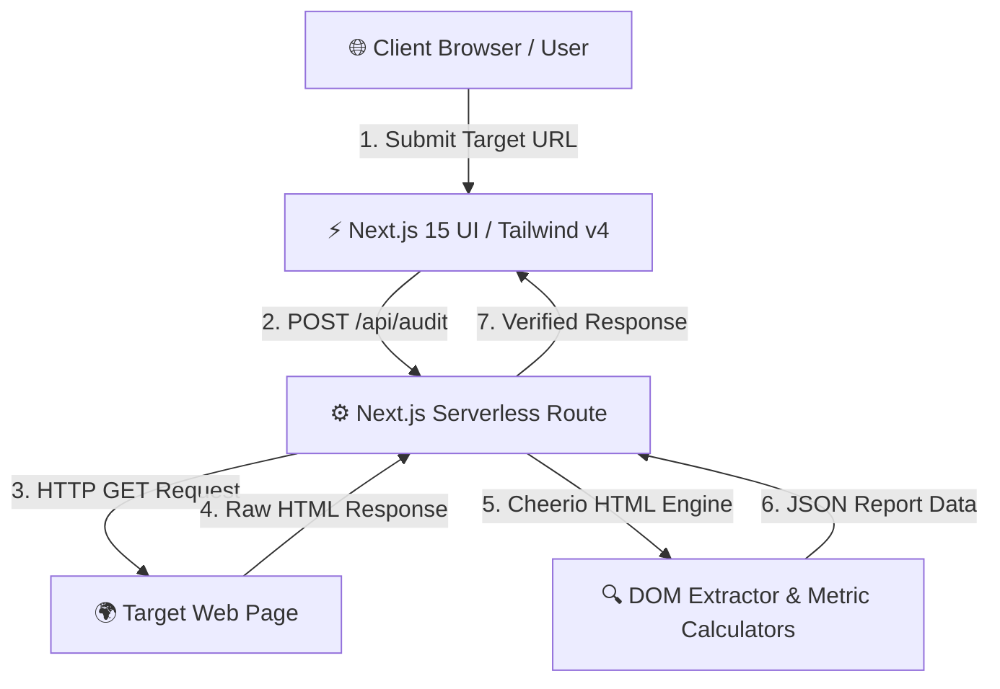

<div align="center">

  # ⚡ PAGE PULSE PRO
  ### *Real-Time Technical SEO, Accessibility & Web Vitals Audit Suite*

  [](https://nextjs.org/)
  [](https://www.typescriptlang.org/)
  [](https://tailwindcss.com/)
  [](https://vercel.com/)
  [](https://opensource.org/licenses/MIT)

  <br />

  [Live Demo](https://audits-url-git-main-manjeet-s-projects8.vercel.app) · [Report Issue](https://github.com/ManjeetPal17/auditsurl/issues) · [Digital Heroes](https://digitalheroesco.com)

</div>

---

## 📖 Overview

**Page Pulse Pro** is an end-to-end, high-performance website auditing platform. Built for modern SEO teams and developers, it scans target URLs in real time to evaluate **Technical Health**, **Heading Hierarchies**, **Accessibility Compliance**, and **Social Meta Indexers**.

> 🎓 **Live Build Requirement Notice:**  
> Built for **[Digital Heroes Training Task](https://digitalheroesco.com)**.

---

## 🏗️ Architecture & Dataflow

Page Pulse Pro is designed for maximum speed and cost-efficiency using **Next.js 15 Serverless Functions**. The frontend and backend API endpoints are unified into a single deployable unit on **Vercel**.



---

## ✨ Key Features

| Feature Category | Capabilities & Inspection Scope |
| :--- | :--- |
| **⚡ Real-Time Crawler** | Instant HTTP response timing, status code validation, content byte-length calculation, and server header inspections. |
| **🔍 Technical SEO Audit** | Canonical tag verification, Meta Description length checker, Open Graph (`og:title`, `og:description`), Twitter Cards, and Robots directives. |
| **♿ Accessibility Guard** | Image `alt` attribute scanner (flags missing alternate text descriptions) and $H1 \to H3$ structural heading hierarchy analysis. |
| **📊 Smart Interactive UI** | Seamless Light/Dark mode switching, history persistence via LocalStorage, live history filtering, JSON copy/export, and styled report downloads. |
| **🛡️ Resilience & Fail-safes** | Graceful error handling for DNS lookup failures (`ENOTFOUND`), connection timeouts, non-HTML page formats, safe hostname fallbacks, and malformed URL structures. |

---

## 📂 Project Structure

```
auditsurl/
├── package.json                  # 🚀 Root Monorepo Runner (npm run dev:all)
├── .npmrc                        # Vercel Legacy Peer Dependencies Configuration
├── frontend/                     # Next.js Fullstack Workspace
│   ├── app/                      # App Router Architecture
│   │   ├── api/
│   │   │   └── audit/
│   │   │       └── route.ts      # ⚡ Serverless Audit API Endpoint
│   │   ├── dashboard/
│   │   │   └── page.tsx          # Interactive Audit Dashboard
│   │   ├── globals.css           # Design Tokens & Glassmorphism Utilities
│   │   ├── layout.tsx            # Root Layout with Font & SEO Metadata
│   │   └── page.tsx              # Landing Page with Digital Heroes Footer
│   ├── components/
│   │   ├── DashboardUI.tsx       # Core Analytics Dashboard & Safe Hostname Extractor
│   │   └── ThemeContext.tsx      # Global Light / Dark Mode State
│   ├── lib/
│   │   └── cheerioParser.ts      # 🔍 High-Performance HTML Extractor Engine
│   ├── package.json              # Client & Serverless Dependencies
│   └── tsconfig.json             # TypeScript Strict Configuration
├── backend/                      # Standalone Express API (Jest Tested)
│   ├── src/
│   │   ├── controllers/          # Express Controllers
│   │   ├── parser/               # Cheerio DOM Parser
│   │   └── tests/                # 🧪 Jest & Supertest Suite
│   └── package.json
└── README.md                     # Project Documentation
```

---

## 🛠️ Local Development Setup

### Prerequisites
- **Node.js** `v18.x` or `v20.x`
- **npm** `v9.x` or higher

### Installation & Run

1. **Clone the repository**:
   ```bash
   git clone https://github.com/ManjeetPal17/auditsurl.git
   cd auditsurl
   ```

2. **Install dependencies**:
   ```bash
   npm install --legacy-peer-deps
   ```

3. **Start Fullstack (Frontend + Backend concurrently)**:
   ```bash
   npm run dev:all
   ```

4. Open `http://localhost:4001` in your web browser.

---

## 🧪 Testing & Verification

The core DOM parsing engine and failure handlers are backed by **Jest** unit and integration tests.

To run tests:
```bash
cd backend
npm run test
```

---

## 📋 API Contract

### **Endpoint**: `POST /api/audit`

#### **Request Headers**:
```http
Content-Type: application/json
```

#### **Request Body**:
```json
{
  "url": "https://example.com"
}
```

#### **Success Response (`200 OK`)**:
```json
{
  "success": true,
  "data": {
    "status": 200,
    "responseTime": 182,
    "title": "Example Domain",
    "description": "This domain is for illustrative examples.",
    "keywords": "example, domain, documentation",
    "canonical": "https://example.com",
    "language": "en",
    "charset": "utf-8",
    "h1Count": 1,
    "h2Count": 2,
    "h3Count": 0,
    "missingAltImagesCount": 0,
    "totalImagesCount": 4,
    "externalLinksCount": 2,
    "internalLinksCount": 12,
    "approximateWordCount": 145,
    "ogTitle": "Example Domain",
    "ogDescription": "Official Example Page",
    "twitterCard": "summary_large_image",
    "robotsMeta": "index, follow",
    "faviconUrl": "https://example.com/favicon.ico",
    "contentType": "text/html; charset=UTF-8",
    "contentLength": 1256,
    "serverHeader": "ECS (sea/552B)",
    "dateHeader": "Sat, 25 Jul 2026 12:45:00 GMT"
  }
}
```

---

## 💡 Key Design Decisions & Tradeoffs

1. **Serverless Unification over Separate Express Server**:
   - *Reasoning*: Unifying the backend audit endpoint into Next.js Serverless Routes (`/api/audit`) allows deploying both Frontend and Backend on **Vercel** under a single project with **zero CORS friction** and **zero extra hosting costs**.

2. **Cheerio Selector Engine vs. Headless Browser (Puppeteer/Playwright)**:
   - *Reasoning*: Cheerio operates directly on standard raw HTML strings via streaming HTTP GET requests. This makes the crawler **$10\times$ faster**, keeps RAM usage minimal, and prevents serverless function execution timeouts.

3. **Client-Side Storage for Audit History & Safe Parsing Safeguards**:
   - *Reasoning*: LocalStorage was chosen for saving audit history. Combined with a custom `getHostname` error fallback wrapper, the UI guarantees zero latency retrieval, total user privacy, and zero client runtime crashes on malformed inputs.

---

## 📜 License & Acknowledgments

Built for the **Digital Heroes Training Task**.  
Visit **[Digital Heroes](https://digitalheroesco.com)** for official guidelines.

Licensed under the [MIT License](LICENSE).
